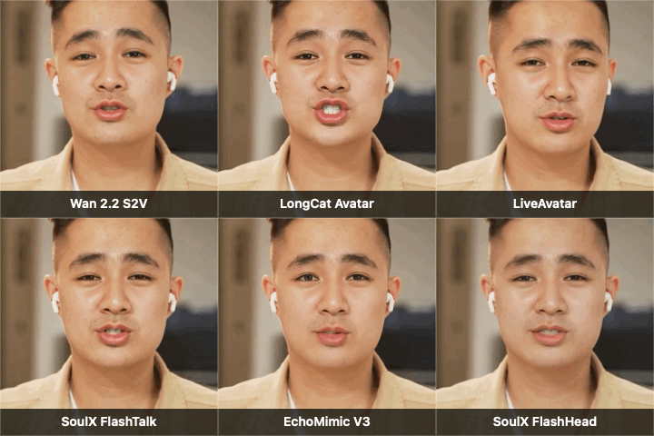

# Open-source talking-avatar benchmark (2026)

[](report/open-source-talking-avatar-benchmark-2026.pdf)
[](https://github.com/tight-studio/open-source-talking-avatar-benchmark/actions/workflows/validate.yml)
[](LICENSE)

We ran every talking-avatar model that met two predeclared criteria on August 23, 2026: an official usable release during the preceding year and more than 1,000 GitHub stars. Six of seven qualifying models completed from the same public portrait and 3.63-second narration.

This repository publishes the runnable Modal harnesses, machine-readable measurements, muted result videos, checksums, and the full [technical report](REPORT.md). It accompanies Tight Studio's [plain-language benchmark article](https://tight.studio/blog/open-source-talking-avatar-models/).

> This is a deployment benchmark, not a controlled perceptual study. We intentionally used each project's recommended runnable path, so resolution, inference steps, quantization, and GPU class differ.

## Main findings

| Finding | Result |
|---|---|
| Sharpest heavyweight result | **LiveAvatar**, 181.44 s on H200, 61,401 MiB peak VRAM |
| Best deployment balance | **EchoMimicV3-Flash**, 251.94 s on L40S, 33,726 MiB peak VRAM |
| Most expressive motion | **LongCat-Video-Avatar 1.5**, 233.08 s on H200 |
| Lowest memory | **SoulX-FlashHead Lite**, 5,763 MiB peak VRAM |
| Slowest successful run | **Wan2.2-S2V-14B**, 780.29 s for a 3.813 s output |
| Blocked run | **LTX-2.3 DubIt**, official checkpoint approval was unavailable |

## Result gallery



This compact preview is a 2.4-second, 10 fps center crop for quick scanning, not quality evaluation. The full-resolution H.264 videos below are the public results used in the [benchmark article](https://tight.studio/blog/open-source-talking-avatar-models/).

### Wan2.2-S2V-14B

https://tight.studio/blog/open-source-talking-avatar-models/wan22-s2v-stock-avatar.mp4

Stable identity and background with restrained motion; 512 x 896 at 16 fps.

### LongCat-Video-Avatar 1.5

https://tight.studio/blog/open-source-talking-avatar-models/longcat-stock-avatar.mp4

The most expressive head and body performance, including motion absent from the reference frame; 480 x 832 at 25 fps.

### LiveAvatar

https://tight.studio/blog/open-source-talking-avatar-models/liveavatar-stock-avatar.mp4

The sharpest heavyweight identity with convincing, restrained expression; 384 x 704 at 25 fps.

### SoulX-FlashTalk

https://tight.studio/blog/open-source-talking-avatar-models/soulx-flashtalk-stock-avatar.mp4

A stable face with clear mouth motion; 416 x 720 at 25 fps.

### EchoMimicV3-Flash

https://tight.studio/blog/open-source-talking-avatar-models/echomimic-v3-flash-stock-avatar.mp4

The strongest quality-to-infrastructure balance in this test; 480 x 848 at 25 fps.

### SoulX-FlashHead Lite

https://tight.studio/blog/open-source-talking-avatar-models/soulx-flashhead-stock-avatar.mp4

The lowest-memory result, with a tighter crop and softer identity; 512 x 512 at 25 fps.

## Repository map

```text
assets/           Reference image, result posters, and compact animated preview
data/             CSV and JSON benchmark records
report/           Versioned PDF technical report
results/videos/   Muted generated outputs
runners/modal/    Pinned Modal runners for all seven models
scripts/          Artifact validation and audio-removal utilities
REPORT.md         Technical report source
REPRODUCING.md    Setup and rerun commands
```

## Reproduce or inspect

The quickest no-GPU check is:

```bash
python3 scripts/validate_repository.py
```

Rerunning inference requires a Modal account, access to the relevant weights, and paid GPU compute. See [REPRODUCING.md](REPRODUCING.md) before starting a job.

## Responsible use

Use only portraits, videos, and voices you own or have permission to animate. Do not use these runners to impersonate people, bypass consent, or create deceptive media. The included portrait came from an AI-generated Pexels video; its creator does not endorse this work.

## Licensing and media notices

Original Tight Studio code, text, and tabular data are released under the [MIT License](LICENSE). The reference frame, generated videos, model repositories, and checkpoints have separate terms described in [ASSET_NOTICES.md](ASSET_NOTICES.md). No model weights or upstream model source code are redistributed here.

## Citation

Citation metadata is available in [CITATION.cff](CITATION.cff). In prose:

> Jiang, Ethan, and Tight Studio. 2026. *A Deployment Benchmark of Popular Open-Source Talking-Avatar Models Released in 2025-2026*. Version 1.0.0.
